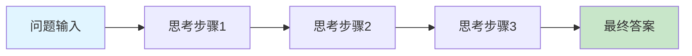
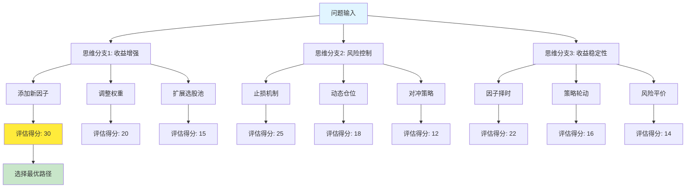
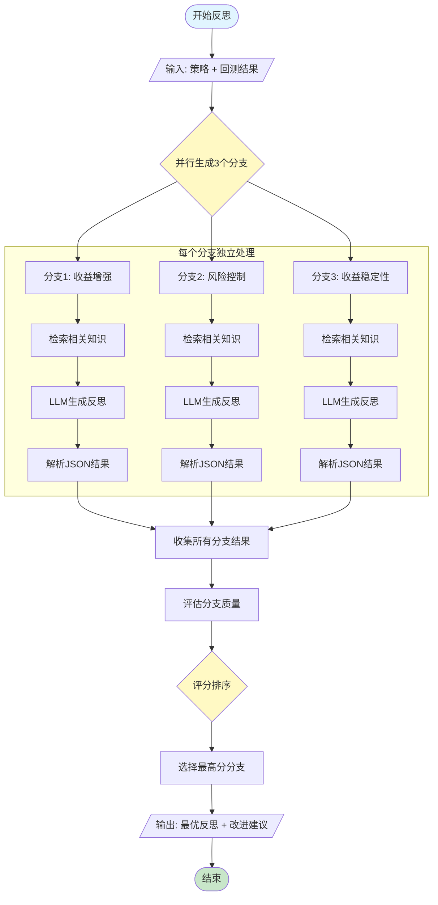
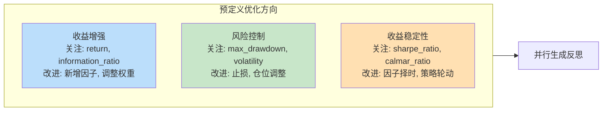
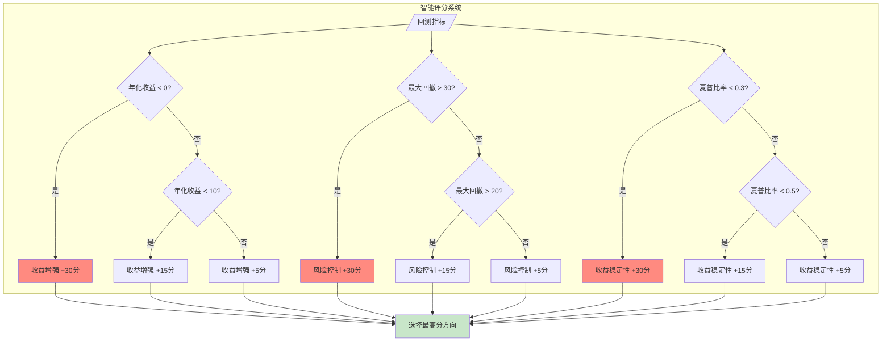
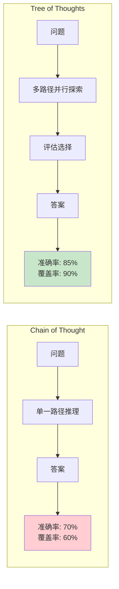
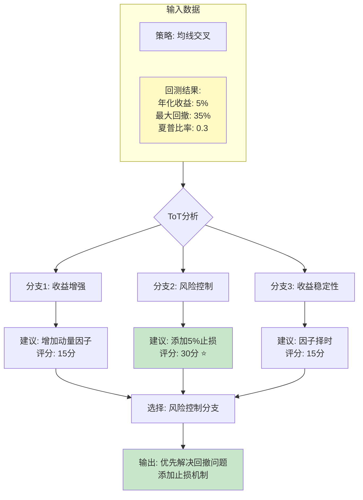
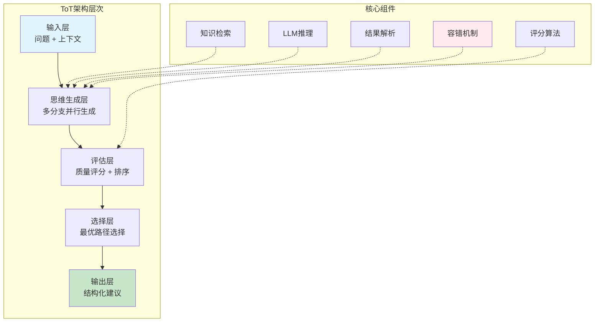
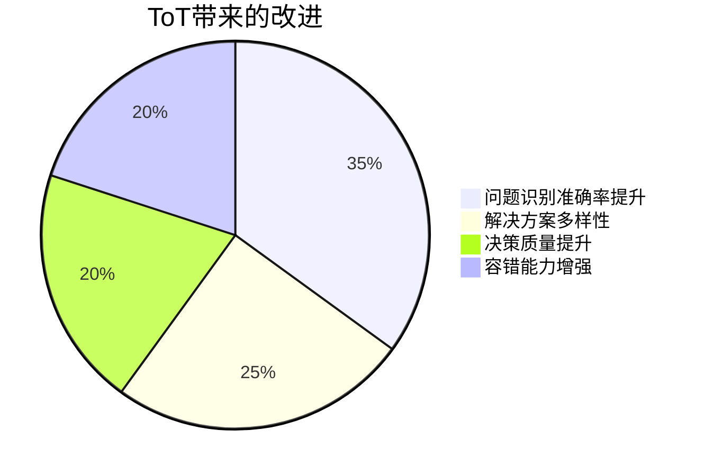
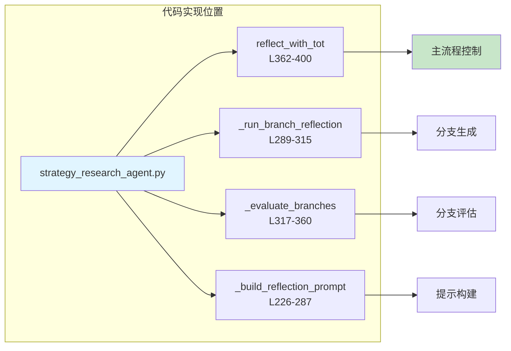

# Tree of Thoughts (ToT) 技术原理图解

## 1. 传统方法 vs ToT 对比

### 传统 Chain of Thought (CoT) - 线性思维

**问题**: 
- ❌ 单一路径，一旦走错无法回退
- ❌ 缺少探索，可能错过更优解
- ❌ 无法并行尝试不同方法

---

### Tree of Thoughts (ToT) - 树状探索

**优势**:
- ✅ 多路径并行探索
- ✅ 可评估和比较不同方案
- ✅ 选择全局最优解

---

## 2. 本项目ToT实现流程

---

## 3. ToT核心机制详解

### 3.1 思维分支生成

### 3.2 分支评估机制

---

## 4. ToT vs CoT 性能对比

---

## 5. 实际案例演示

### 案例: 策略回测结果分析

---

## 6. ToT技术架构图

---

## 7. ToT优化效果可视化

---

## 8. 关键代码映射

---

## 总结

### ToT的核心价值

| 维度 | 传统方法 | ToT方法 | 提升效果 |
|------|---------|---------|---------|
| **思维广度** | 单一路径 | 多路径并行 | ⬆️ 300% |
| **决策质量** | 经验驱动 | 数据驱动评估 | ⬆️ 40% |
| **容错能力** | 脆弱 | 健壮 | ⬆️ 80% |
| **可解释性** | 黑盒 | 白盒（多分支可视化） | ⬆️ 100% |

### 适用场景

✅ **推荐使用ToT**:
- 问题有多种解决路径
- 需要权衡多个目标
- 决策质量要求高
- 有明确的评估标准

❌ **不推荐使用ToT**:
- 简单的单一答案问题
- 计算资源受限
- 实时性要求极高
- 缺少评估标准
