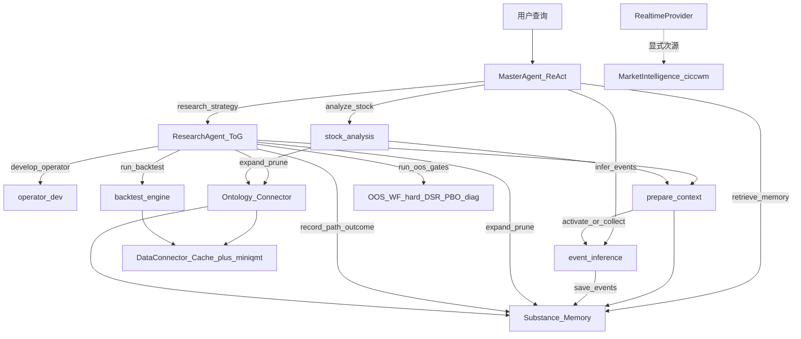
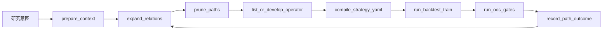

# Long Earn 架构总览（ADR-018 后）

> **代码是第一真相**。本文描述稳定的运行时结构与依赖边界；字段级细节以源码为准。  
> 决策背景见 [ADR-018](adr/018-think-on-graph-research-agent.md)；论文映射见 [research/papers/tog-mechanism-mapping.md](research/papers/tog-mechanism-mapping.md)。

---

## 1. 一句话

**MasterAgent 编排用户任务；ResearchAgent 按 ToG 正反馈闭环探索策略；回测引擎与统计门提供不可跳过的证据；Substance / Ontology 是共享知识图；数据层按能力显式点名，不做静默降级。**

---

## 2. 运行时调用图

---

## 3. 分层（整洁架构）

| 层 | 职责 | 代表模块 |
|----|------|----------|
| L0 智能体 | 任务分解 / ToG 探索 | `master_agent` · `strategy_rd/research_agent` |
| L1 领域子图工具 | 深度能力，非编排中枢 | `stock_analysis` · `event_inference` · `operator_dev` |
| L2 服务与技能 | DI、Persona、监控、LLM | `RuntimeContext` · `services/*` · `skills/personas` |
| L3 领域内核 | 证据机与知识图 | `backtest` · `substance` · `ontology` · 算子目录 |
| L4 数据与存储 | 显式多源 + Cache | PostgreSQL Cache · miniqmt · ciccwm 情报 · `LONG_EARN_DATA_DIR` |

依赖方向：`tools` → `services` → `domain`（import-linter 卡口）。

---

## 4. 策略研发正反馈闭环（ToG）

| 角色 | 谁决定 | 谁强制 |
|------|--------|--------|
| 探索哪条假设 | ResearchAgent（LLM） | — |
| 是否回测 / OOS | — | 工具契约 + AcceptanceGate / 统计门 |
| 算子上线 | — | `prove_causality` |
| 数据分割 | — | `AppConfig` 三段式铁律 |

假设树：保留为 **beam 谱系 / 状态存储**。合并硬闸与 DSR/PBO 诊断用法见 **ADR-022（统计验证门控）**（ADR-015 仅保留失败反馈 / 探索修复）。`create_htr_subgraph` 与 HTR 编排实现已删除（ADR-010 Deprecated）；策略研发入口为 `ResearchAgent`。

---

## 5. 数据层（禁止跨源静默换源）

| 能力组 | 接口 | 源选择 |
|--------|------|--------|
| 历史面板 | `DataConnector` | PostgreSQL Cache + **显式主源 miniqmt**；失败即失败 |
| 市场情报 | `MarketIntelligenceProvider` | **ciccwm 独占**（资金流/热榜等） |
| 实时行情 | `RealtimeDataProvider` | 主源 miniqmt；不可用时**显式切换** ciccwm 并打日志 |

调用方或 Ontology 按 concept **点名**能力，禁止把异质源串成静默 fallback 链。

---

## 6. 关键入口

| 场景 | 入口 |
|------|------|
| CLI / 对话 | `MasterAgent(context).invoke(...)` |
| 直入策略研发闭环 | `ResearchAgent(context).invoke(idea, constraints)` |
| 上下文激活 | `context.prepare_context(query)`（确定性；miss 采集由 agent 显式触发，ADR-021） |

DI：一律 `create_runtime_context()` / `initialize_context()`，禁止无 context 构造 Agent。
